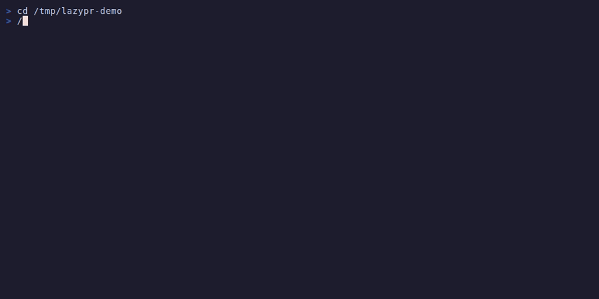

# lazypr

[](https://github.com/karkigrishmin/lazypr/actions/workflows/ci.yml)
[](https://opensource.org/licenses/MIT)
[](https://www.rust-lang.org/)
[](https://github.com/karkigrishmin/lazypr/releases)

**The lazygit of pull requests** — a free, open-source, terminal-native TUI tool built in Rust that makes PR review fast, intelligent, and beautiful. No AI, no cloud, no API keys.


## The Problem

GitHub's PR review experience is broken for large changesets:

- **As a reviewer**: You open a PR with 50+ files, feel overwhelmed. You waste time on lockfiles, snapshots, and generated code. You can't tell which files have actual logic vs. wiring. You lose your place between sessions. You end up skimming and approving.
- **As an author**: You push everything as one big PR because splitting is painful. Reviewers skim and approve because nobody has time to review 70 files deeply.

**lazypr** solves both sides with local-first, deterministic, zero-AI static analysis.

## Features

### Smart Review
- **Heatmap scoring** — Files sorted by review priority (Deep/Scan/Glance/Skip) based on logic lines, file category, and churn risk
- **Three-color diff** — Green (added), Red (removed), Cyan (moved code between files)
- **Semantic diff** — Shows function-level changes inline: `+2fn ~1sig -1fn`
- **Syntax highlighting** — Full syntax highlighting via syntect
- **Move detection** — Detects code moved between files using content hashing
- **File classification** — Auto-categorizes: Source, Test, Config, Lock, Generated, Snapshot, etc.
- **File churn** — Git history analysis boosts priority for frequently-changed files

### Review State
- **Session tracking** — Remembers which files you've viewed across sessions
- **Inter-diff** — Toggle to show only changes since your last review
- **Private notes** — Attach line-level notes that persist locally
- **Checklists** — Project-specific review checklists from `.lazypr/checklist.yml`
- **Progress bar** — Track how many files you've reviewed

### Pre-Push Analysis
- **Ghost analysis** — Find broken imports, missing tests, high-impact changes before you push
- **Impact analysis** — See all files that depend on a changed file (direct + transitive)
- **Dependency graph** — Built from parsed imports using petgraph

### Smart Split
- **Auto-grouping** — Clusters files into dependency-ordered review groups
- **Size budgets** — Respects configurable target/max group sizes
- **Stacked branches** — Creates git branches for each group
- **Create PRs** — Optionally create GitHub draft PRs from split branches (`--create-prs`)
- **Validation** — Checks that each group's imports resolve correctly

### GitHub Integration
- **PR inbox** — See your open PRs and review requests in the terminal
- **GitHub provider** — Connects via `GITHUB_TOKEN` or `gh` CLI auth
- **Split → PR** — Create stacked draft PRs directly from `lazypr split --execute --create-prs`
- **Open in browser** — Press `o` in the inbox TUI to open a PR in your browser

### Multi-Language Parsers
- **TypeScript/JavaScript** — Tree-sitter AST parser (imports, exports, functions)
- **Python** — Regex parser (import/from, def, class)
- **Rust** — Regex parser (use/mod, fn, pub struct/enum/trait)
- **Generic** — Fallback regex parser for any language

## Installation

### From source

```bash
git clone https://github.com/karkigrishmin/lazypr.git
cd lazypr
cargo install --path .
```

### Build manually

```bash
cargo build --release
# Binary at target/release/lazypr
```

## Quick Start

```bash
# Navigate to any git repo on a feature branch
cd your-project
git checkout your-feature-branch

# Launch the review TUI
lazypr review

# Or get JSON output
lazypr review --json

# Pre-push analysis
lazypr ghost

# Dependency impact for a file
lazypr impact src/utils/helpers.ts

# Split plan
lazypr split --dry-run
```

## Example Output

### Ghost Analysis — catch issues before you push



```
$ lazypr ghost

Ghost analysis: feature/user-dashboard vs main

WARNINGS (6):
  [MISSING_TEST] src/components/Dashboard.tsx — no corresponding test file
  [MISSING_TEST] src/utils/analytics.ts — no corresponding test file
  [MISSING_TEST] src/hooks/useAuth.ts — no corresponding test file

Summary: 0 errors, 6 warnings, 0 info
```

### Split Plan — auto-split big PRs

```
$ lazypr split --dry-run

Split plan: 2 groups, 0 skipped files

  Group 1: src (4 files, 112 lines)
    src/hooks/useAuth.ts
    src/components/UserProfile.tsx
    src/components/StatsPanel.tsx
    src/utils/analytics.ts

  Group 2: src (4 files, 79 lines) [depends on: 1]
    src/components/Dashboard.tsx
    src/App.css
    src/App.tsx
    src/types/api.ts

Validation: OK
```

## Commands

| Command | Description |
|---------|-------------|
| `lazypr review` | Interactive TUI review (default) |
| `lazypr ghost` | Pre-push analysis — broken imports, missing tests, high-impact |
| `lazypr impact <file>` | Show dependency impact for a file |
| `lazypr split` | Generate a split plan for the PR |
| `lazypr split --dry-run` | Preview split without creating branches |
| `lazypr split --execute` | Create stacked branches |
| `lazypr split --execute --create-prs` | Create branches + GitHub draft PRs |
| `lazypr inbox` | PR inbox — your PRs and review requests |

### Global Flags

| Flag | Description |
|------|-------------|
| `--json` | Output as JSON instead of TUI |
| `--base <ref>` | Override base branch (default: auto-detect main/develop) |
| `-v, --verbose` | Enable verbose output |

## TUI Keybindings

| Key | Action |
|-----|--------|
| `j`/`k` | Navigate up/down |
| `Tab` | Switch panes |
| `Enter` | Select file |
| `s` | Skip file |
| `v` | Mark file as viewed |
| `/` | Search files |
| `n` | Add note (in diff pane) |
| `c` | Open checklist |
| `i` | Toggle inter-diff mode |
| `Ctrl-d`/`Ctrl-u` | Half-page scroll |
| `g`/`G` | Jump to top/bottom |
| `1`-`4` | Switch screens |
| `?` | Help overlay |
| `q` | Quit |

## Configuration

### `.lazypr/config.yml`

```yaml
# Base branch (auto-detected if not set)
base_branch: main

# Review settings
review:
  move_detection_min_lines: 3
  move_similarity_threshold: 0.85
  skip_patterns:
    - "*.snap"
    - "package-lock.json"

# Split settings
split:
  target_group_size: 150  # logic lines per group
  max_group_size: 400

# Display
display:
  theme: auto
  syntax_highlighting: true
  side_by_side: false

# Remote (optional — for inbox and split→PR)
remote:
  remote_name: origin  # git remote to detect provider from
```

### `.lazypr/checklist.yml`

```yaml
- when: "src/hooks/*"
  checks:
    - "Cleanup in useEffect?"
    - "Error handling for async?"
    - "Tests added?"

- when: "src/api/**"
  checks:
    - "Error response handling?"
    - "Rate limiting considered?"
```

## Architecture

```
+---------------------------------------------------+
|              TUI Layer (ratatui)                   |
|  ReviewScreen  SplitScreen  InboxScreen  Ghost    |
+---------------------------------------------------+
|              Command Layer                         |
|  review  split  ghost  impact  inbox              |
+---------------------------------------------------+
|              Core Engine (no IO)                   |
|  Differ  Graph  Splitter  Analyzer  Parsers       |
+--------------------+------------------------------+
|  Git Layer (git2)  |  State Layer (.lazypr/)       |
|  diff, blame, log  |  sessions, notes, checklist   |
+--------------------+------------------------------+
|         Remote Layer (optional)                    |
|         octocrab (GitHub) / GitLab                 |
+---------------------------------------------------+
```

**Key rules:**
- Core engine has no IO — takes data in, returns structured results
- State stored in `.lazypr/` directory (gitignored)
- Remote layer is optional — every feature works offline
- Every command supports `--json` output

## Design Philosophy

- **Local-first** — Everything computed from git. Works offline.
- **Deterministic** — Same input, same output. No probabilistic responses.
- **Zero config** — Running `lazypr` in a git repo does something useful immediately.
- **Composable** — Every command supports `--json`. Pipe to jq, to CI, to other tools.
- **No AI** — Intelligence comes from static analysis, graph theory, and git history.

## Roadmap

- [x] Phase 0: Foundation — CLI, git2, TUI skeleton
- [x] Phase 1: Review TUI — Heatmap, three-color diff, syntax highlighting
- [x] Phase 2: Review state — Sessions, inter-diff, notes
- [x] Phase 3: Ghost + Impact — Parsers, dependency graph, analysis
- [x] Phase 4: Smart Split — Topological sort, grouping, stacked branches
- [x] Phase 5: Remote — GitHub API, PR inbox, split→PR creation
- [x] Phase 6: Semantic diff — Function-level changes, checklists, churn

## Tech Stack

- **Rust** with 2021 edition
- **ratatui** — Terminal UI framework
- **git2** — Git operations (vendored OpenSSL)
- **octocrab** — GitHub API client
- **tree-sitter** — TypeScript/JavaScript parsing
- **petgraph** — Dependency graph algorithms
- **syntect** — Syntax highlighting
- **xxhash** — Fast content hashing for move detection
- **tokio** — Async runtime (for GitHub API)

## Contributing

1. Fork the repository
2. Create a feature branch
3. Run checks: `cargo fmt && cargo clippy -- -D warnings && cargo test`
4. Submit a pull request

## License

MIT License. See [LICENSE](LICENSE) for details.
